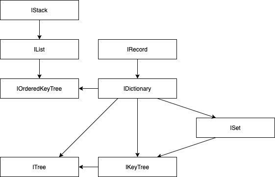

# Immutable Data Structures

## 🧬 Structure Typeclasses

- [x] [IDictionary](./src/structures/ImmutableDictionary/IDictionary.d.ts)
- [x] [IList](./src/structures/IList/ImmutableList.d.ts)
- [x] [ISet](./src/structures/ISet/ImmutableSet.d.ts)
- [x] [IStack](./src/structures/IStack/ImmutableStack.d.ts)
- [x] [IKeyTree](./src/structures/IKeyTree/IKeyTree.d.ts)
- [x] [ITree](./src/structures/ITree/ITree.d.ts)
- [x] [IOrderedKeyTree](./src/structures/IOrderedKeyTree/IOrderedKeyTree.d.ts)
- [x] [IRecord](./src/structures/IRecord/IRecord.d.ts)
- [x] [IOrderedTree](./src/structures/IOrderedTree/IOrderedTree.d.ts)

## 🛠 Utility Functions

- [x] [flow](./src/utils/flow/flow.ts)
- [x] [hash](./src/utils/hash/hash.ts)
- [x] [pipe](./src/utils/pipe/pipe.ts)
- [x] [doNothing](./src/utils/doNothing/doNothing.ts)

## 👻 Type Helpers

- [x] [AnyKey](./src/types/AnyKey.ts)
- [x] [Predicate](./src/types/Predicate.ts)
- [x] [TypeGuard](./src/types/TypeGuard.ts)
- [x] [Transform](./src/types/Transform.ts)
